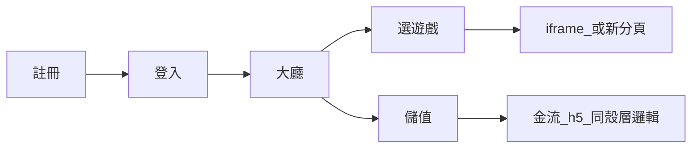

# Web 大廳架構

## 產品流程

1. 使用者完成註冊後可登入；已登入者持有 access token（見 [api-spec.md](api-spec.md)）。
2. 大廳向後端撈遊戲列表並顯示；點選遊戲依後端回傳的 URL 與顯示參數開啟 **遊戲殼**（內嵌 iframe 或新分頁），行為與倉庫根目錄 `index.html` 內 `ShowGameCenteredFromHtml` 一致（不含 Unity `SendMessage`，見 [game-shell.md](game-shell.md)）。
3. 儲值同樣走殼層，但 `iframe` 的 `allow` 需含 `payment` 等，與舊 Unity 外殼中金流頁相同。

## React 路由

| 路徑 | 說明 | 保護 |
| --- | --- | --- |
| `/login` | 登入 | 公開 |
| `/register` | 註冊 | 公開 |
| `/` | 大廳 | 需登入 |
| `/events` | 活動 | 需登入（佔位內容可替換） |
| `/profile` | 我的：餘額、儲值入口 | 需登入 |

未登入而造訪受保護路徑時，導向 `/login?redirect=<原始路徑>`，登入成功後導回。

## 用戶狀態

- `AuthProvider` 保存 access token 與使用者摘要（`localStorage` 鍵名見程式 `TOKEN_STORAGE_KEY`）。
- `401` 時清掉 token 並導向登入；餘額等可在從遊戲或金流頁回到大廳時手動或自動 `GET /user/me` 刷新（見 Profile／Header 實作）。

## 遊戲與金流殼層

純 SPA 沒有 Unity 父層，因此不呼叫 `OnWebViewHide`；以 React 內的 overlay 實作下列對等行為：

- 內嵌：全螢幕遮罩、置中 `iframe`、寬高百分比、關閉鈕。
- 金流：`allow` 與 [index.html](../index.html) 中金流頁相同（`payment`、fullscreen 等）。
- 新分頁：`window.open`；若後端或設定要求預設新分頁，對應舊的 `OPEN_GAMES_IN_NEW_WINDOW_DEFAULT` 可由環境變數 `VITE_OPEN_GAMES_IN_NEW_WINDOW` 在 Web 大廳重現。

實作位於 `web/src/lib/gameShell.ts` 與 `web/src/components/GameOverlay.tsx`。
