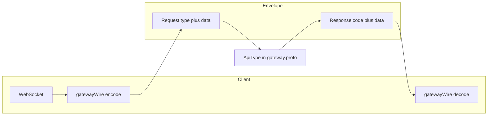

# Gateway Protobuf 與 API 說明

本文件說明本專案中 **Gateway 通訊** 相關的 proto 定義：Web 端使用的精簡 wire 型別（[`web/proto`](../proto)）與 **業務 API 代號** 的權威來源（倉庫根目錄 [`proto/gateway/gateway.proto`](../../proto/gateway/gateway.proto) 之 `ApiType`）。

- **權威清單**：`Request.type` / `Response.type` 的整數值以 `ApiType` 為準；注釋以 proto 原文為準，本文件不臆測未寫入 proto 的細節。
- **Web 實作**：二進位 `Request` / `Response` 編解碼見 [`web/src/realtime/gatewayWire.ts`](../src/realtime/gatewayWire.ts)；`LOBBY_GET` 常數見 [`web/src/realtime/gatewayApi.ts`](../src/realtime/gatewayApi.ts)。

---

## 1. 簡介：封包與 `ApiType`

客戶端以 **`gateway.Request` / `gateway.Response`** 為外層封包。其中 `type` 欄位對應 **`enum ApiType`**，決定 `data` bytes 實際承載的 protobuf 訊息型別（由各業務子 package 定義，見主 repo 對應 `.proto`）。

**HTTP 風格語意（字串 `code`）**（與 [`gatewayWire.ts`](../src/realtime/gatewayWire.ts) 的 `isGatewaySuccessCode` 及 [`proto/gateway/gateway.proto`](../../proto/gateway/gateway.proto) 內 `Response` 欄位註解一致）：

- **`200`**：成功且可能有 `data`。
- **`204`**：成功但無 `data` 回傳。
- 其餘：錯誤代碼，參考 `errMessage`。

> `type = 0`（`PING_PONG`）在 `Response` 註解中標為 pingpong 用途。



---

## 2. 傳輸層訊息（`web/proto/gateway_wire.proto`）

與 [`proto/gateway/gateway.proto`](../../proto/gateway/gateway.proto) 之 `Request` / `Response` / `RequestBasic` / `ResponseBasic` **欄位編號一致**；變更需同步兩邊並執行 `npm run proto:generate`（見 [`web/proto/gateway_wire.proto`](../proto/gateway_wire.proto) 註解）。

### 2.1 `RequestBasic`

| 欄位        | 型別   | 說明（依 proto 註解）              |
| ----------- | ------ | ---------------------------------- |
| `userID`    | uint64 |                                    |
| `timestamp` | int64  | 請求發起 UTC 時間戳                |
| `clientVer` | string | 客戶端版本                         |
| `requestID` | string | 客戶端產生，可追蹤                 |
| `gameID`    | uint64 |                                    |
| `roomID`    | string |                                    |
| `host`      | string |                                    |
| `token`     | string | lazy register userID to connection |

### 2.2 `Request`

| 欄位    | 型別           | 說明                   |
| ------- | -------------- | ---------------------- |
| `basic` | `RequestBasic` | 上表                   |
| `type`  | int64          | 對應 `ApiType`         |
| `data`  | bytes          | 依 `type` 決定內層訊息 |

### 2.3 `ResponseBasic`

| 欄位        | 型別   | 說明 |
| ----------- | ------ | ---- |
| `requestID` | string |      |
| `timestamp` | int64  |      |
| `serverVer` | string |      |

### 2.4 `Response`

| 欄位         | 型別            | 說明                                |
| ------------ | --------------- | ----------------------------------- |
| `basic`      | `ResponseBasic` | 上表                                |
| `type`       | int64           | 對應 `ApiType`；註解：0 為 pingpong |
| `code`       | string          | 200 / 204 等，見上節                |
| `errMessage` | string          |                                     |
| `data`       | bytes           | 回傳資料                            |
| `gameID`     | uint64          | 後端使用                            |

---

## 3. 大廳遊戲列表（`web/proto/lobby_wire.proto`）

與 [`proto/megaman/lobby.proto`](../../proto/megaman/lobby.proto) 中 **`LobbyGetResponse` 的 `games`（及與遊戲清單相關欄位）** 對齊，供前端解碼；主 repo 變更需同步本檔。

本精簡檔定義的 enum 包含：`YesNo`、`GameStatus`、`GameCategory`、`GameLabel`、`GameLogoPictureSize`、`GameJoinRoomPolicy`。

**`message Game`** 主要欄位（節錄，完整欄位見 proto）：`ID`、`displayName`、`status`、`category`、`label`、`updateTimeMS`、`updater`、`iconURL`、`roomMinNums`、`sort`、`joinRoomPolicy`、`maintainTime`、`maintainReason`、`path`、`gameLockByToken`、`isBlockchain`、各種排序欄位、`unlockLevel` / `unlockVipLevel`、`rtp` 相關欄位等。

**`ListGameResponse`**：`repeated Game games`。

**`LobbyGetResponse`**：`ListGameResponse games`（欄位編號 2，與 megaman `LobbyGetResponse` 中遊戲清單位置對應意義一致；精簡版僅含 `games` 供 Web 解碼）。

**完整大廳資料**：伺服器在 `LOBBY_GET` 回傳的 `data` 於完整協定中可能為 megaman 的 `LobbyGetResponse`（另含錢包、玩家資訊、活動等），欄位多於 `lobby_wire`。專案內針對遊戲列表的轉換見 [`web/src/realtime/lobbyDecode.ts`](../src/realtime/lobbyDecode.ts)。

---

## 4. gRPC 服務 `GatewayService`（`proto/gateway/gateway.proto`）

後端以 gRPC 暴露下列 **RPC**（實際部署與路由依基礎建設而定）：

| RPC                   | 請求                     | 回應                    | 註解         |
| --------------------- | ------------------------ | ----------------------- | ------------ |
| `Gateway`             | `Request`                | `Response`              | 主交換路徑   |
| `Schedule`            | `ScheduleReq`            | `google.protobuf.Empty` |              |
| `RegisterConnect`     | `RegisterReq`            | `Empty`                 | connect 用   |
| `HealthyConnect`      | `RegisterReq`            | `Empty`                 | connect 用   |
| `DeleteConnect`       | `DeleteReq`              | `Empty`                 | connect 用   |
| `RegisterUser`        | `RegistryUserReq`        | `RegistryUserResp`      |              |
| `ListPlayerBot`       | `ListPlayerBotReq`       | `ListBotResponse`       |              |
| `SendSystemMsg`       | `SendSystemMsgReq`       | `Empty`                 |              |
| `NotifyDisconnection` | `NotifyDisconnectionReq` | `Empty`                 | 通知玩家斷線 |

**Web 用戶端**若透過 **WebSocket 傳送二進位 `Request` / `Response`**，通道與 gRPC 直連不同，但通常共用 **同一套 `ApiType` 與封包形狀**。

同檔另定義輔助訊息，例如 `UserKickBeforeReason`（`ApiType.USER_KICK_BEFORE` 註解關聯）、`ServerPush` 等；細節見原檔。

---

## 5. `ApiType` 一覽（`proto/gateway/gateway.proto`）

數值與行尾注釋皆摘自 proto；**已註解掉的列**在 proto 中未生效，下表一併省略（若需追蹤歷史請直接看原檔）。

> **本 Web 大廳（`web`）**：帳密登入僅走 **REST** `POST /api/v1/login`；**不** 經 WebSocket 送下表之 `SERVER_LOGIN`（4）。大廳 WS 僅用 `PING_PONG`、`LOBBY_GET` 等。下表仍列出後端 `ApiType` 列舉供全專案 proto 參考。

### 大廳 Jackpot（`GET_JACKPOT_INFO` vs `SLOT_JACKPOT_INFO_PUSH` vs `JACKPOT_INFO_PUSH`）

與累積獎池相關的 Gateway `ApiType` 有三個常見代號，請勿混淆名稱或數值：

| 名稱                     | 值   | 方向            | `data`／用途（依 [`proto/gateway/gateway.proto`](../../proto/gateway/gateway.proto) 與 [`web/proto/lobby_wire.proto`](../proto/lobby_wire.proto)）                                    |
| ------------------------ | ---- | --------------- | ------------------------------------------------------------------------------------------------------------------------------------------------------------------------------------- |
| `SLOT_JACKPOT_INFO_PUSH` | 14   | 伺服器 → 客戶端 | **Web 大廳輕量推播**：`megaman.SlotJackPotInfo`（`repeated int64 jackpot_amounts`），前端通常取前三格顯示於跑馬／ ticker。                                                            |
| `GET_BET_LEVEL`          | 14   | （已棄用）      | **與上行同值**：`enum ApiType` 設有 `option allow_alias = true`；proto 註解標為 `deprecated`，請勿再當作下注等級語意。                                                                |
| `GET_JACKPOT_INFO`       | 141  | 請求 / 回應     | **Ranking 區塊**（`gateway.proto`）；回應形狀以 **megaman** 下方 **`ListJackPotResp`／`JackPotInfo`** 為準（見 [`proto/megaman/ranking.proto`](../../proto/megaman/ranking.proto)）。 |
| `JACKPOT_INFO_PUSH`      | 1043 | 伺服器 → 客戶端 | **Server push 區段（1000 後）**廣播；常見載荷與 **14** 同為 **`SlotJackPotInfo`**，若以結構化列表下發則對齊 **`ListJackPotResp`**（仍以伺服器實際 `data` 為準）。                     |

#### 權威訊息形狀：`GET_JACKPOT_INFO`(141) 回應

以下節錄自 [`proto/megaman/ranking.proto`](../../proto/megaman/ranking.proto)，作為 **`ListJackPotResp`**／**`JackPotInfo`** 的唯一依據（與 **`ranking.gRPC`** 的 **`ListJackPot` → `JackPotMoneyPool`** 不同路由，請勿混淆）：

```protobuf
message ListJackPotResp { repeated JackPotInfo info = 1; }

message JackPotInfo {
  ranking.JackPotType JackPotType = 1;
  float amount = 2; // 現在金額倍率
  int64 award = 3; // 獎項
  WalletType walletType = 4; // 錢包類型（megaman，見下）
}
```

- **`JackPotType`**：`megaman.JackPotInfo` 宣告為 **`ranking.JackPotType`**，數值見 [`proto/ranking/ranking.proto`](../../proto/ranking/ranking.proto) 之 `enum JackPotType`（`UNKNOWN_JACK_POT_TYPE`…`HUNDRED_COLOR_DICE_JACK_POT`…`BIG_WIN = 99` 等）。
- **`WalletType`**：於 megaman 原始檔中對應 [`proto/megaman/lobby.proto`](../../proto/megaman/lobby.proto) 之 `enum WalletType`（`UNKNOWN_WALLET_TYPE = 0`、`GC = 1`、`SC = 2`）。此與 [`proto/ranking/ranking.proto`](../../proto/ranking/ranking.proto) 內同名之 `WalletType` **非同一型別定義**；二進位相容性僅依枚舉數值一致與否判斷。

Web 單檔 mirror（供 protobufjs 編解碼，欄位編號須一致）：[`web/proto/lobby_wire.proto`](../proto/lobby_wire.proto) 內對應 **`ListJackPotResp`／`JackPotInfo`／`JackPotType`／`WalletType`**。

`GAME_JACKPOT_INFO`（2001）等偏遊戲內／其他通道，與大廳 WS 並列於 [`proto/gateway/gateway.proto`](../../proto/gateway/gateway.proto) 「Slot」註解區塊，使用時請與上表區分。

### 5.1 基礎 / 大廳 / 錢包 / 系統

| 名稱                        | 值  | 註釋（proto）                                     |
| --------------------------- | --- | ------------------------------------------------- |
| `PING_PONG`                 | 0   |                                                   |
| `JOIN_ROOM`                 | 1   |                                                   |
| `USER_KICK_BEFORE`          | 2   | meesage UserKickBeforeReason                      |
| `SERVER_UPDATE`             | 3   |                                                   |
| `SERVER_LOGIN`              | 4   |                                                   |
| `LOBBY_GET`                 | 11  |                                                   |
| `WALLET_GET`                | 12  |                                                   |
| `WALLET_USE`                | 112 |                                                   |
| `GET_SYSTEM_TIME`           | 13  |                                                   |
| `SLOT_JACKPOT_INFO_PUSH`    | 14  | Web/WebGL lobby：`data`=`megaman.SlotJackPotInfo` |
| `GET_BET_LEVEL`             | 14  | `deprecated`，與 `SLOT_JACKPOT_INFO_PUSH` 別名    |
| `SEND_MESSAGE`              | 15  |                                                   |
| `GET_LOGIN_AWARD`           | 16  | 每日登入獎勵清單                                  |
| `RECEIVE_LOGIN_AWARD`       | 17  | 領取登入獎勵                                      |
| `GetSummonedAwardList`      | 18  | 招回獎勵清單                                      |
| `ReceiveSummonedAward`      | 19  | 領取招回獎勵                                      |
| `GET_DAILY_AWARD`           | 945 | 每日回饋                                          |
| `RECEIVE_DAILY_AWARD`       | 946 | 領取回饋                                          |
| `LIST_DAILY_AWARD`          | 947 | 每日回饋獎勵紀錄                                  |
| `LIST_DAILY_DETAIL_AWARD`   | 948 | 每日回饋明細紀錄                                  |
| `GET_DAILY_AWARD_BONUS`     | 949 | 每日回饋加碼                                      |
| `RECEIVE_DAILY_AWARD_BONUS` | 950 | 領取回饋加碼                                      |

### 5.2 Player info

| 名稱                          | 值  | 註釋（proto）                                                    |
| ----------------------------- | --- | ---------------------------------------------------------------- |
| `GET_PLAYER_INFO`             | 20  |                                                                  |
| `UPDATE_PLAYER_INFO`          | 21  |                                                                  |
| `LIST_PLAYER_AVATARS`         | 22  |                                                                  |
| `UPDATE_PLAYER_AVATAR`        | 23  |                                                                  |
| `GET_PLAYER_ROLE`             | 24  |                                                                  |
| `ADD_PLAYER_ROLE`             | 25  |                                                                  |
| `UPDATE_PLAYER_ROLE`          | 26  |                                                                  |
| `RESET_MEGA_PASS`             | 27  |                                                                  |
| `ADD_PLAYER_EXP`              | 28  |                                                                  |
| `ADD_PLAYER_ANGLE`            | 29  |                                                                  |
| `UPDATE_PLAYER_ANGLE`         | 30  |                                                                  |
| `GET_PLAYER_ANGLE`            | 31  |                                                                  |
| `SENDER_PLAYER_GIFT`          | 32  |                                                                  |
| `UPDATE_NOVICE_TEACHING`      | 33  | 新手教學                                                         |
| `DELETE_ACCOUNT`              | 34  |                                                                  |
| `LIST_STRANGER`               | 35  |                                                                  |
| `CHANGE_ACCOUNT_BINDING`      | 36  |                                                                  |
| `LIST_STRANGER_WITHOUT_CHECK` | 37  | 列出所有玩家，不做任何額外的檢查。用來讓遊戲端查詢待加入好友名單 |
| `VALIDATE_SECOND_PASSWORD`    | 38  |                                                                  |
| `SEND_RICH_DADDY_GIFT`        | 39  |                                                                  |

### 5.3 Relation（好友等）

| 名稱                     | 值  | 註釋（proto） |
| ------------------------ | --- | ------------- |
| `LIST_FRIENDS`           | 40  |               |
| `CREATE_FRIENDS`         | 41  |               |
| `CONFIRM_FRIENDS`        | 42  |               |
| `CANCEL_FRIENDS`         | 43  |               |
| `LIST_BLACK_FRIENDS`     | 44  |               |
| `ADD_BLACK_LIST`         | 45  |               |
| `CANCEL_BLACK_LIST`      | 46  |               |
| `LIST_FRIEND_RECOMMENDS` | 47  |               |
| `GET_INVITE_FRIEND`      | 48  |               |

### 5.4 Room

| 名稱                          | 值  | 註釋（proto） |
| ----------------------------- | --- | ------------- |
| `LIST_ROOM`                   | 60  |               |
| `CREATE_PRIVATE_ROOM`         | 61  |               |
| `JOIN_RANDOM_ROOM`            | 62  |               |
| `LOCK_ROOM`                   | 63  |               |
| `INVITE_ROOM`                 | 64  |               |
| `PLAY_TOGETHER`               | 65  |               |
| `PLAY_TOGETHER_TIMEOUT`       | 66  |               |
| `PLAY_TOGETHER_CANCEL`        | 67  |               |
| `PLAY_TOGETHER_EXIST`         | 68  |               |
| `PLAY_TOGETHER_TIMEOUT_EXIST` | 69  |               |
| `GET_NOW_PLAYING`             | 70  |               |
| `CREATE_PASSWORD_ROOM`        | 71  |               |
| `JOIN_PASSWORD_ROOM`          | 72  |               |
| `LIST_PASSWORD_ROOM`          | 73  |               |
| `GET_NOW_PLAYING_COUNT`       | 74  |               |

### 5.5 kaixilo

| 名稱                      | 值  | 註釋（proto）      |
| ------------------------- | --- | ------------------ |
| `GET_KAIXILO`             | 81  |                    |
| `LEVEL_UP_THING`          | 82  |                    |
| `GET_THING`               | 83  |                    |
| `LIST_PARASITES`          | 84  |                    |
| `CREATE_PARASITE`         | 85  |                    |
| `COUNT_INCOME`            | 86  |                    |
| `GET_RANDOM_PLAYER`       | 87  |                    |
| `LIST_RECOMMENDS`         | 88  |                    |
| `UPDATE_THING`            | 89  |                    |
| `LIST_MODEL_IDS`          | 90  |                    |
| `THING_COMPLETE`          | 91  |                    |
| `DAILY_DIVIDENDS`         | 92  | 列出每日分紅       |
| `GET_AVAILABLE_DIVIDENDS` | 93  | 取得可領取分紅點數 |
| `PAY_DIVIDENDS`           | 94  | 領取分紅           |

### 5.6 Red Envelope

| 名稱                         | 值  | 註釋（proto） |
| ---------------------------- | --- | ------------- |
| `SEND`                       | 100 |               |
| `SNATCH`                     | 101 |               |
| `ANSWER`                     | 102 |               |
| `VERIFY_ANSWER`              | 103 |               |
| `LIST_RED_ENVELOPES`         | 104 |               |
| `VERIFY_DAILY_AMOUNT`        | 105 |               |
| `LIST_USER_SEND_ENVELOPES`   | 106 |               |
| `LIST_USER_SNATCH_ENVELOPES` | 107 |               |
| `LIST_CONDITION_SNATCH`      | 109 |               |
| `LIST_CONDITION_SEND`        | 110 |               |
| `COUNT_CONDITION`            | 111 |               |

### 5.7 Ranking

| 名稱                             | 值  | 註釋（proto）                                                                                                                                          |
| -------------------------------- | --- | ------------------------------------------------------------------------------------------------------------------------------------------------------ |
| `ADD_RANKING`                    | 131 |                                                                                                                                                        |
| `LIST_RANKING`                   | 132 |                                                                                                                                                        |
| `GET_DISPLAY_MENUS`              | 136 |                                                                                                                                                        |
| `LIST_COMPETITION`               | 137 |                                                                                                                                                        |
| `LIST_COMPETITION_RANKING`       | 138 |                                                                                                                                                        |
| `GET_COMPETITION_RANKING_REPLAY` | 139 | 取得競賽綁重播回放                                                                                                                                     |
| `LIST_JACKPOT_PLAYER_INFO`       | 140 |                                                                                                                                                        |
| `GET_JACKPOT_INFO`               | 141 | 請求 JP 資訊；回應 **`megaman.ListJackPotResp`**；欄位定義見上節「權威訊息形狀」（[`proto/megaman/ranking.proto`](../../proto/megaman/ranking.proto)） |
| `LIST_PLAYER_BINGO`              | 142 |                                                                                                                                                        |
| `LIST_TOP_BINGOS`                | 143 |                                                                                                                                                        |

### 5.8 social

| 名稱                     | 值  | 註釋（proto） |
| ------------------------ | --- | ------------- |
| `CREATE_CHAT_ROOM`       | 171 |               |
| `GET_CHAT_ROOM`          | 172 |               |
| `LIST_CHAT_ROOM`         | 173 |               |
| `ADD_TO_CHAT_ROOM`       | 174 |               |
| `UPDATE_CHAT_ROOM`       | 175 |               |
| `CONFIRM_ADD_MEMBER`     | 176 |               |
| `UPDATE_POSITION`        | 177 |               |
| `LEAVE`                  | 178 |               |
| `LIST_RECOMMEND_ROOM`    | 179 |               |
| `LIST_ROOM_AMOUNT_LIMIT` | 180 |               |
| `INVITE_TO_CHAT_ROOM`    | 181 |               |
| `CONFIRM_INVITE_MEMBER`  | 182 |               |

### 5.9 guild

| 名稱                            | 值  | 註釋（proto）          |
| ------------------------------- | --- | ---------------------- |
| `CREATE_GUILD`                  | 191 | 創建公會               |
| `GET_GUILD`                     | 192 | 取得公會               |
| `LIST_GUILD`                    | 193 | 公會清單               |
| `APPLY_GUILD`                   | 194 | 申請公會               |
| `UPDATE_GUILD`                  | 195 | 修改公會               |
| `CONFIRM_ADD_GUILD_MEMBER`      | 196 | 會員審核               |
| `CHANGE_MEMBER_POSITION`        | 197 | 更換職位               |
| `LEAVE_GUILD`                   | 198 | 請離公會               |
| `LIST_REFERRER`                 | 199 | 調配會員上級清單       |
| `INVITE_MEMBER`                 | 200 | 邀請會員               |
| `EXTEND_GUILD_TIME`             | 201 | 延長公會時間           |
| `LIST_CONFIRM_MEMBER`           | 202 | 會員審核清單           |
| `LIST_RECOMMENDED`              | 203 | 下級清單               |
| `LIST_MEMBER_SCORE`             | 204 | 個人積分               |
| `GET_GUILD_REPORT`              | 205 | 戰積報告               |
| `CHANGE_MEMBER_REFERRER`        | 206 | 調配會員               |
| `APPLY_LEAVE`                   | 207 | 會員申請離開俱樂部     |
| `LIST_APPLY_LEAVE`              | 208 | 會員申請離開俱樂部清單 |
| `CONFIRM_LEAVE_MEMBER`          | 209 | 審批離開會員           |
| `GET_ROOM_MESSAGE`              | 210 | message Service        |
| `GROUP_ROOM_MESSAGE`            | 211 | message Service        |
| `GET_GUILD_REPORT_DETAIL`       | 212 | 公會戰機報告明細       |
| `GET_GUILD_QRCODE_LINK`         | 213 | 公會取得 qr code 連結  |
| `LIST_GUILD_INVITE_INFO`        | 214 | 代理邀請人數資訊       |
| `LIST_GUILD_INVITE_INFO_DETAIL` | 215 | 代理邀請人數資訊明細   |
| `UPDATE_GUILD_USER_INVITE`      | 216 | 更新公會玩家邀請人數   |
| `CREATE_GUILD_QRCODE_LINK`      | 217 | 產生公會 qr code 連結  |
| `ADD_GUILD_TO_DEEP_LINK`        | 218 | 透過 QR code 進入工會  |
| `LIST_OWN_REFERRER`             | 219 | 自己上級會員清單       |
| `LIST_ALLIANCES`                | 220 | 取得工會聯盟           |
| `UPDATE_USER_TO_MANAGER`        | 221 | 更新俱樂部玩家為管理員 |
| `LIST_USER_TO_REFERRER_POINT`   | 222 | 代理中心               |
| `LIST_GUILD_TOTAL_SCORE`        | 223 | 特殊積分               |
| `GET_MEMBER`                    | 224 | 取得會員               |
| `LIST_MEMBER`                   | 225 | 取得會員List           |

### 5.10 Drop

| 名稱                           | 值  | 註釋（proto）      |
| ------------------------------ | --- | ------------------ |
| `GENERATE_LOOTS`               | 301 | 抽寶箱             |
| `EXCHANGE_COLLECTION`          | 302 | 兌換牌組           |
| `LIST_USER_COLLECTION_RECORDS` | 303 | 列使用者的收集紀錄 |

### 5.11 Store 商城

| 名稱                   | 值  | 註釋（proto） |
| ---------------------- | --- | ------------- |
| `BUY_STORE_ITEM`       | 311 |               |
| `LIST_STORE_ITEMS`     | 312 |               |
| `LIST_APK_STORE_ITEMS` | 313 |               |
| `ListProducts`         | 316 |               |
| `BuyProduct`           | 317 |               |

### 5.12 敏感操作 / 錢包延伸 / 其它

| 名稱                           | 值  | 註釋（proto）                                    |
| ------------------------------ | --- | ------------------------------------------------ |
| `SECONDARY_PASSWORD_SETTING`   | 330 | 二次密碼設置 playinfo                            |
| `SECONDARY_PASSWORD_CHANGE`    | 331 | 二次密碼更改 playinfo                            |
| `SECONDARY_PASSWORD_FORGOT`    | 332 | 二次密碼忘記 <<?                                 |
| `SMS_VERIFY`                   | 333 | sms 驗證碼驗證                                   |
| `WALLET_SAVING_AMOUNT`         | 335 | 保險金操作 將錢包金額 移出移入 保險箱 wallet     |
| `WALLET_EXCHANGE_PAYMENTPOINT` | 336 | 點數兌換成金幣 ExchangePaymentPointToGlodRequest |
| `WALLET_FROZEN_RECORD`         | 337 | 錢包凍結紀錄 WalletFrozenRecordResponse          |
| `GET_TOKEN`                    | 338 |                                                  |
| `LIST_TOKEN`                   | 339 |                                                  |
| `DIAMOND_TRADE`                | 340 |                                                  |
| `BIG_WIN`                      | 350 | 大獎推送                                         |
| `GET_AND_CHECK_FORTUNE_COIN`   | 351 |                                                  |
| `LIST_MEGA_PACKAGE`            | 352 |                                                  |
| `LIST_DAILY_PACKAGE`           | 353 |                                                  |

### 5.13 Inbox

| 名稱                      | 值  | 註釋（proto）                                    |
| ------------------------- | --- | ------------------------------------------------ |
| `LIST_INBOX`              | 370 | 玩家信箱                                         |
| `LIST_HOMEPAGE_CAMPAIGN`  | 371 | 首頁 inbox                                       |
| `CAMPAIGN_CLICK`          | 372 | 點擊inbox時呼叫 返回 跳轉內容                    |
| `ReceiveDailyInboxReward` | 373 | 領取每日inbox獎勵 => ReceiveDailyInboxRewardResp |

### 5.14 backpack

| 名稱            | 值  | 註釋（proto）     |
| --------------- | --- | ----------------- |
| `LIST_BACKPACK` | 401 | 背包列表          |
| `USE_ITEM`      | 402 | 使用物品 (現金券) |

### 5.15 序號 / 帳號綁定

| 名稱                         | 值  | 註釋（proto）                                        |
| ---------------------------- | --- | ---------------------------------------------------- |
| `GetSerialStatus`            | 360 | 序號狀態                                             |
| `SerialRegister`             | 361 | 序號兌換                                             |
| `MegaAccountBinding`         | 362 | mega帳號綁定 MegaAccountBindingRequest               |
| `ThirdpartyAccountBinding`   | 363 | 第三方帳號綁定 ThirdpartyAccountBindingRequest       |
| `PhoneUnBinding`             | 364 | 手機解除綁定                                         |
| `ThirdpartyAccountUnBinding` | 365 | 第三方帳號解除綁定 ThirdpartyAccountUnBindingRequest |

### 5.16 event

| 名稱                     | 值  | 註釋（proto） |
| ------------------------ | --- | ------------- |
| `LIST_EVENTS`            | 421 |               |
| `ACCEPTING_REWARD`       | 422 |               |
| `EXCHANGE_SW_SERIAL_NUM` | 440 |               |
| `EXCHANGE_SERIAL_NUM`    | 441 |               |
| `LIST_MAHJONG_REPLAY`    | 461 |               |
| `LIST_REPLAY`            | 462 |               |
| `GET_REPLAY`             | 463 |               |

### 5.17 activity / lottery / mission / 幸運轉盤

| 名稱                                 | 值  | 註釋（proto）            |
| ------------------------------------ | --- | ------------------------ |
| `LIST_ACTIVITY`                      | 470 | 取得活動列表             |
| `GET_ACTIVITY`                       | 471 | 取得活動詳情             |
| `GET_ACTIVITY_IMAGE`                 | 472 | 取得活動圖片             |
| `LIST_LOTTERY_DRAW`                  | 480 | 取得樂透開獎列表         |
| `LIST_LOTTERY_TICKETS`               | 481 | 取得彩券列表             |
| `GET_USER_ACTIVITY_NOTIFICATION_RED` | 482 | 取得玩家活動通知紅點資訊 |
| `UPSERT_USER_LATEST_READ_TICKET`     | 483 | 更新玩家最新讀取的彩票ID |
| `LIST_MISSION`                       | 490 | 取得任務列表             |
| `GET_USER_MISSION_PROGRESS`          | 491 | 取得玩家任務進度         |
| `GET_LUCKY_TIMES`                    | 492 | 取得玩家幸運轉盤次數     |
| `RECEIVE_LUCKY_PRODUCT`              | 493 | 取得幸運轉盤獎品         |
| `LIST_LUCKY_RANKING`                 | 494 | 幸運轉盤排名             |
| `ACTIVITY_COLLECT_REWARD`            | 495 | 領取活動獎勵             |

### 5.18 推廣 / 推薦

| 名稱                        | 值  | 註釋（proto）        |
| --------------------------- | --- | -------------------- |
| `BINDING_REFERRER_CODE`     | 531 | 綁定推薦碼           |
| `LIST_PLAYER_REFERRER`      | 537 |                      |
| `GET_USER_TO_REFERRER_CODE` | 538 |                      |
| `GET_REFERRAL_INFO`         | 540 | 取得推廣好友活動資訊 |
| `CLAIM_REFERRAL_REWARD`     | 541 | 領取推廣獎勵         |

### 5.19 Auction

| 名稱                 | 值  | 註釋（proto）    |
| -------------------- | --- | ---------------- |
| `GetAuctionSettings` | 550 | 取得拍賣設定     |
| `ListAuctions`       | 551 | 取得拍賣中心列表 |
| `MyAuctions`         | 552 | 取得我的拍賣列表 |
| `AddAuction`         | 553 | 新增/上架拍賣    |
| `DiscontinueAuction` | 554 | 下架拍賣         |
| `DealAuction`        | 555 | 成交拍賣         |

### 5.20 金主榜 / 提現 / 第三方遊戲

| 名稱                    | 值  | 註釋（proto）      |
| ----------------------- | --- | ------------------ |
| `ListRichDaddies`       | 600 | 金主榜單           |
| `LIST_WITHDRAW_ORDERS`  | 621 | 取得提現單         |
| `CREATE_WITHDRAW_ORDER` | 623 | 建立提現單         |
| `GetThirdPartyGameInfo` | 701 | 取得第三方遊戲資訊 |

### 5.21 錦標賽（大廳 / 遊戲內）

| 名稱                                           | 值  | 註釋（proto）                             |
| ---------------------------------------------- | --- | ----------------------------------------- |
| `LIST_GAME_SIDE_TOURNAMENTS_INFO`              | 901 | 在大廳 取得錦標賽資訊(game side)          |
| `LIST_GAME_SIDE_PRIZE_SETTING`                 | 902 | 取得錦標賽獎勵(game side)                 |
| `GET_GAME_SIDE_HOLDEM_TOURNAMENTS_SETTING`     | 903 | 取得德州樸克錦標賽設定(game side)         |
| `GET_GAME_SIDE_BLIND_STRUCTURE_SET`            | 904 | 取得德州樸克錦標賽盲住結構組合(game side) |
| `GET_MY_REGISTERED_TOURNAMENTS`                | 905 | 取得單筆我已報名的錦標賽資訊              |
| `LIST_MY_REGISTERED_TOURNAMENTS`               | 906 | 取得我已報名的錦標賽資訊列表              |
| `LIST_GAME_SIDE_POST_TOURNAMENTS_RANKING`      | 907 | 取得德州樸克錦標賽賽後排名(game side)     |
| `LIST_GAME_SIDE_REAL_TIME_TOURNAMENTS_RANKING` | 908 | 取得德州樸克錦標賽即時排名(game side)     |
| `GET_GAME_SIDE_TOURNAMENTS_INFO`               | 909 | 在大廳 取得單筆錦標賽資訊(game side)      |
| `GET_TOURNAMENTS_AWARD_WINNING_RECORD`         | 910 | 取得錦標賽獎勵派發紀錄                    |
| `GET_GAME_SIDE_TOURNAMENTS_INFO_IN_GAME`       | 929 | 在遊戲內 取得單筆錦標賽資訊(game side)    |
| `PRE_JOIN_TOURNAMENTS_ROOM`                    | 940 | 在加入房間前的預先檢查流程                |
| `REGISTER_TOURNAMENTS`                         | 941 | 在大廳 報名錦標賽 (首購/重買)             |
| `ADD_ON_TOURNAMENTS`                           | 942 | 在大廳 續買/多買籌碼                      |
| `REGISTER_TOURNAMENTS_IN_GAME`                 | 943 | 在遊戲內 報名錦標賽 (首購/重買)           |
| `ADD_ON_TOURNAMENTS_IN_GAME`                   | 944 | 在遊戲內 續買/多買籌碼                    |

### 5.22 Server push 類（proto 註解：多放在 1000 後，不必與一般請求用同一套 switch 分支邏輯）

此類多為**伺服器主動下發**之 `type`，客戶端處理推播/訊息 UI；**實際行為**以產品與伺服器實作為準。

| 名稱                                    | 值   | 註釋（proto）                                                                                     |
| --------------------------------------- | ---- | ------------------------------------------------------------------------------------------------- |
| `SEND_MESSAGE_PUSH`                     | 1000 |                                                                                                   |
| `INVITE_TO_CHAT_ROOM_PUSH`              | 1001 |                                                                                                   |
| `INVITE_TO_GUILD_PUSH`                  | 1002 |                                                                                                   |
| `INVITE_ROOM_PUSH`                      | 1003 |                                                                                                   |
| `PLAY_TOGETHER_PUSH`                    | 1004 |                                                                                                   |
| `LEAVE_GROUP_PUSH`                      | 1005 |                                                                                                   |
| `ADD_GROUP_PUSH`                        | 1006 |                                                                                                   |
| `CHANGE_GROUP_NAME_PUSH`                | 1007 |                                                                                                   |
| `MEGA_WIN_PUSH`                         | 1008 |                                                                                                   |
| `PLAYER_VIP_LEVEL_UP`                   | 1009 |                                                                                                   |
| `GOT_RED_ENVELOPE_PUSH`                 | 1010 |                                                                                                   |
| `LAST_ORDER_PUSH`                       | 1011 |                                                                                                   |
| `RED_ENVELOPE_REFUND_PUSH`              | 1012 |                                                                                                   |
| `PAYMENT_FINISH_PUSH`                   | 1013 |                                                                                                   |
| `YOU_GOT_SOMETHING_PUSH`                | 1014 |                                                                                                   |
| `CAMPAIGN_PUSH`                         | 1020 |                                                                                                   |
| `INVITE_FRIEND_PUSH`                    | 1021 | player info                                                                                       |
| `GET_TREASURE_BOX_PUSH`                 | 1022 |                                                                                                   |
| `BLOCK_MSG_PUSH`                        | 1023 | 封鎖使用者 收到此訊息 可跳訊息並回到登入介面 (server 會再發出訊息後三秒內斷開連線)                |
| `GIFT_MSG_PUSH`                         | 1024 | 送禮消息                                                                                          |
| `SERVER_MSG_PUSH`                       | 1025 | 系統訊息推送 SeverPushMessage                                                                     |
| `SYSTEM_MAINTENANCE_MSG_PUSH`           | 1026 | 系統維護 收到此訊息 可跳訊息並回到登入介面 (server 會再發出訊息後三秒內斷開連線) 204              |
| `ADD_OR_LEAVE_GUILD_MSG_PUSH`           | 1027 | 加入或請離公會訊息                                                                                |
| `CHANGE_GUILD_MEMBER_POSITION_MSG_PUSH` | 1028 | 更換公會成員職位訊息                                                                              |
| `GUILD_DIVIDENDS_MSG_PUSH`              | 1029 | 公會分紅訊息                                                                                      |
| `GUILD_AUTO_MSG_PUSH`                   | 1030 | 公會自動推播訊息                                                                                  |
| `APPLY_LEAVE_GUILD_MSG_PUSH`            | 1031 | 申請離開退出後的訊息                                                                              |
| `SNATCH_RED_ENVELOPE_PUSH`              | 1032 |                                                                                                   |
| `TOKEN_REFUND_PUSH`                     | 1033 |                                                                                                   |
| `CHANGE_DEALER_PUSH`                    | 1034 |                                                                                                   |
| `DAILY_LOGIN_AWARD_MSG_PUSH`            | 1035 | 每入登入獎勵的訊息                                                                                |
| `BAN_PLAYER_MSG_PUSH`                   | 1036 |                                                                                                   |
| `ACTIVITY_LUCKY_MSG_PUSH`               | 1037 | 幸運輪盤送獎訊息                                                                                  |
| `QR_CODE_ADD_GUID_MSG_PUSH`             | 1038 | 透過 QR code 加入俱樂部系統訊息 to 推薦人                                                         |
| `RED_ENVELOPE_VERIFY_PUSH`              | 1039 |                                                                                                   |
| `UPDATE_GUILD_USER_TO_MANAGER_PUSH`     | 1040 | 俱樂部移除或是設定該會員為管理者訊息                                                              |
| `GOT_LOTTERY_TICKETS`                   | 1041 | 獲得彩券通知                                                                                      |
| `GAME_END_PUSH`                         | 1042 | 獲得彩券通知                                                                                      |
| `JACKPOT_INFO_PUSH`                     | 1043 | JP 資訊廣播；`SlotJackPotInfo` 或 **`ListJackPotResp`**（細見上文「權威訊息形狀」，以伺服器為準） |
| `EVENT_JACKPOT_PUSH`                    | 1044 |                                                                                                   |
| `WITHDRAW_SUCCESS_PUSH`                 | 1048 | 提現成功推波                                                                                      |
| `DRAW_LOTTERY_AWARD`                    | 1050 | 樂透中獎通知                                                                                      |
| `RECEIVED_LOTTERY_TICKETS`              | 1051 | 獲得彩券通知                                                                                      |
| `PLAYER_LEVEL_UP`                       | 1052 |                                                                                                   |
| `SEND_ITEM_PUSH`                        | 1053 |                                                                                                   |
| `COMPETITION_AWARD_MSG_PUSH`            | 1054 | 競賽獎勵通知                                                                                      |
| `RICH_DADDAY_GIFT_MSG_PUSH`             | 1055 | 金主霸霸拜禮                                                                                      |
| `RICH_DADDAY_AWARD_MSG_PUSH`            | 1056 | 金主霸霸回饋                                                                                      |
| `RICH_DADDY_ONLINE_MSG_PUSH`            | 1057 | 金主霸霸上線                                                                                      |
| `SUMMONED_AWARD`                        | 1060 |                                                                                                   |
| `TOURNAMENTS_STARTING_SOON_PUSH`        | 1070 | 錦標賽即將開賽通知 (開賽前10分鐘、3分鐘、30秒)                                                    |
| `TOURNAMENTS_STARTING_PUSH`             | 1071 | 錦標賽開賽通知                                                                                    |
| `TOURNAMENTS_AWARDS_DISTRIBUTION_PUSH`  | 1072 | 獎勵發放通知                                                                                      |
| `AUCTION_DISCONTINED_PUSH`              | 1081 | 下架拍賣通知                                                                                      |
| `AUCTION_COMPLETED_PUSH`                | 1082 | 買家拍賣通知                                                                                      |
| `AUCTION_RECEIVED_PUSH`                 | 1083 | 賣家拍賣通知                                                                                      |
| `RECEIVE_DAILY_BONUS_PUSH`              | 1084 | 領取額外每日回饋通知                                                                              |

### 5.23 Slot

| 名稱                      | 值   | 註釋（proto） |
| ------------------------- | ---- | ------------- |
| `GAME_JACKPOT_INFO`       | 2001 |               |
| `LIST_JACKPOT_BINGO_INFO` | 2002 |               |

### 5.24 GM（僅測試）

| 名稱                 | 值   | 註釋（proto）       |
| -------------------- | ---- | ------------------- |
| `GM_COMMAND_GENERAL` | 9000 | GmCommandGeneralReq |

---

## 6. 附錄：`ScheduleType`（後端排程，不是一般 `Request.type`）

`proto/gateway/gateway.proto` 中 **`ScheduleReq.type`** 使用 **`enum ScheduleType`**，用於內部排程/定時工作，**與** 客戶端業務 `ApiType` **不同**，請勿混淆。完整列舉見原檔（自 `UNKNOWN_SCHEDULE_TYPE = 0` 至 `DAILY_DAU_STATISTIC = 52` 等）。

---

## 7. 維運與同步

- [`web/proto/gateway_wire.proto`](../proto/gateway_wire.proto) / [`web/proto/lobby_wire.proto`](../proto/lobby_wire.proto) 須與主 repo 之 [`proto/gateway/gateway.proto`](../../proto/gateway/gateway.proto)、[`proto/megaman/lobby.proto`](../../proto/megaman/lobby.proto) 欄位編號與語意保持同步。
- 變更 `web/proto` 後在 `web` 目錄執行 **`npm run proto:generate`**，以更新產生之 schema（供 `gatewayWire` 使用）。

---

_本文件產生自專內 proto；若與執行中伺服器行為不一致，以伺服器與主 repo 最新 proto 為準。_
